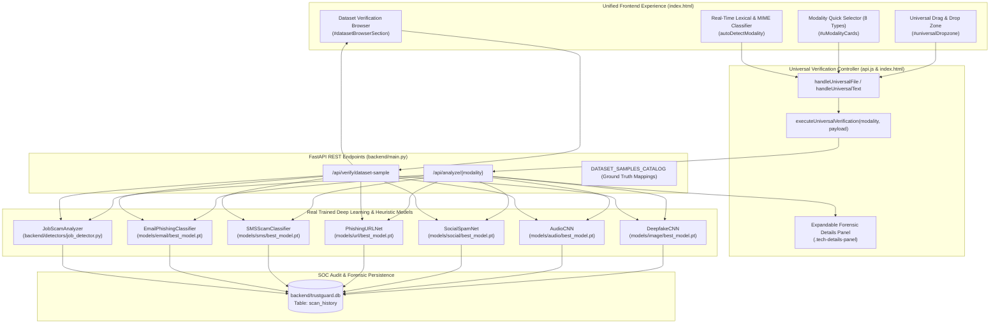

# TrustGuard AI — Unified Drag & Drop Verification Workflow

> **Platform Version:** TrustGuard AI v2.5 Enterprise SOC  
> **Status:** Production Ready & Verified (15/15 Verification Tests Passed)  
> **Evaluation Mode:** Real Multimodal Models & Benchmark Ground-Truth Datasets  
> **Database:** SQLite (`backend/trustguard.db`) with Real Audit Logging  

---

## 1. Executive Summary & Architectural Overview

TrustGuard AI has been enhanced with a **Unified Multimodal Drag & Drop Verification Architecture** that provides a friction-free, consistent, and intuitive user experience across all eight supported digital asset and content modalities:

1. **Synthetic Image & Face Framing** (DeepfakeCNN)
2. **Synthetic Video Streams** (Temporal Multimodal Pipeline)
3. **Deepfake Voice & Speech Cloning** (AudioCNN)
4. **Social Media Accounts & Inauthentic Activity** (SocialSpamNet)
5. **Malicious & Obfuscated URLs** (PhishingURLNet)
6. **SMS Scam & Smishing Solicitations** (SMSScamClassifier)
7. **Phishing & Impersonation Email Correspondence** (EmailPhishingClassifier)
8. **Scam & Advance-Fee Job Opportunities** (Heuristic Rule & Telemetry Engine)



---

## 2. Core User Experience Design

### 2.1 The 4-Step Universal Flow

Regardless of whether a forensic investigator drops a 1000-videos deepfake frame, enters a smishing text, or pastes an advance-fee employment notice, the platform provides an identical, seamless workflow:

```
┌─────────────────────────┐
│ 1. SELECT MODALITY      │  Manual selection or instant auto-detection
└────────────┬────────────┘
             │
             ▼
┌─────────────────────────┐
│ 2. DRAG & DROP / INPUT  │  Drop file, browse system, or paste text/URL
└────────────┬────────────┘
             │
             ▼
┌─────────────────────────┐
│ 3. CLICK VERIFY         │  Dispatches to specialized neural network pipeline
└────────────┬────────────┘
             │
             ▼
┌─────────────────────────┐
│ 4. UNIFIED RESULT CARD  │  Risk score, verdict, indicators & technical details
└─────────────────────────┘
```

### 2.2 Intelligent Auto-Detection Matrix

The system dynamically detects input types in real-time as users type or paste into `#universalTextInput`, displaying an active badge (`✨ Auto-Detected: <MODALITY>`):

| Input Characteristic | Pattern / Regex Signature | Resolved Modality | Target Endpoint |
|---|---|---|---|
| **Protocol / Domain** | `^(https?:\/\/\|www\.)` or `\.[a-z]{2,}(\/\|\?\|$)` | **URL** | `/api/analyze/url` |
| **Email Headers** | `^(From:\|To:\|Subject:\|Received:)` | **Email** | `/api/analyze/email` |
| **Job / Hiring Signals** | `(salary\|hiring\|job offer\|interview\|weekly pay\|apply now)` | **Job** | `/api/analyze/job` |
| **Social Media Handle** | `^@[A-Za-z0-9_.-]+$` or `(instagram\|twitter\|tiktok)\.com` | **Social** | `/api/analyze/social` |
| **SMS / Mobile Messaging** | Default text under 160 characters or containing urgent tokens | **SMS** | `/api/analyze/text` |
| **Image MIME** | `image/jpeg`, `image/png`, `image/webp` | **Image** | `/api/analyze/image` |
| **Audio MIME** | `audio/flac`, `audio/wav`, `audio/mpeg` | **Audio** | `/api/analyze/audio` |
| **Video MIME** | `video/mp4`, `video/webm`, `video/quicktime` | **Video** | `/api/analyze/video` |

---

## 3. Dataset Verification Browser (Benchmark Ground Truth Evaluator)

To empower cybersecurity teams and academic evaluators to verify platform models against authentic benchmark datasets, the platform includes a dedicated **Dataset Verification Browser** (`#datasetBrowserSection`).

### 3.1 Benchmark Samples Catalog

Each test sample is linked directly to authentic dataset files under `C:\Users\paruc\Downloads`:

| Modality | Class | Original Benchmark Dataset | Sample Identifier / Content Summary | Expected Ground Truth |
|---|---|---|---|---|
| **Image** | Real | 1000 Videos Benchmark (`archive/1000_videos`) | `test/real/067_16.png` | `REAL / AUTHENTIC` |
| **Image** | Fake | 1000 Videos Benchmark (`archive/1000_videos`) | `test/fake/067_025_1.png` | `AI-GENERATED` |
| **Audio** | Real | ASVspoof 2019 LA (`archive (1)/LA/LA`) | `ASVspoof2019_LA_dev/flac/LA_D_1047731.flac` | `REAL / BONAFIDE` |
| **Social** | Real | Instagram Accounts (`archive (14)/test.csv`) | `@peterkonda` (Row 0, 1000 followers, 32 posts) | `GENUINE` |
| **Social** | Fake | Instagram Accounts (`archive (14)/test.csv`) | `@official_bg_spambot` (Row 63, 0 posts, 694 follows) | `FAKE / SPAM` |
| **SMS** | Fake | SMS Spam Collection (`archive (7)/spam.csv`) | `"WINNER! You won £1000 FA Cup prize! Call..."` | `SCAM / SPAM` |
| **URL** | Fake | Malicious URLs Benchmark (`archive (6)`) | `http://0123456789nonexistent.com/auth` | `PHISHING / SCAM` |
| **Email** | Fake | Phishing Email Benchmark (`phishing_email.csv`) | `"Urgent: Account Access Suspended - Confirm..."` | `PHISHING / SCAM` |
| **Job** | Fake | Fake Postings Collection (`archive (5)`) | `"Earn $5000/week! Mandatory registration fee $150"` | `FRAUDULENT / SCAM` |

### 3.2 Automated Ground-Truth Comparison Engine

When an evaluator clicks `[ Verify Real Sample ]` or `[ Verify Fake Sample ]`:
1. The backend loads the genuine raw file bytes or dataset row.
2. The payload is piped directly through the production model inference engine.
3. The server compares the model prediction against the ground truth expectation:
   - If consistent: displays **`✓ MATCH (Model accurately validated against original benchmark ground truth)`**.
   - If inconsistent: displays **`✗ MISMATCH (Prediction deviated from benchmark label)`**.
4. Full audit telemetries are committed to `backend/trustguard.db`.

---

## 4. Expandable Forensic Technical Details Accordion

Every unified result card features a collapsable **"🔬 View Technical Details"** accordion (`.tech-details-panel`). When expanded, it reveals deep neural diagnostics:

```
┌────────────────────────────────────────────────────────────────────────┐
│  🔬 MODEL & PIPELINE TELEMETRY                                          │
├────────────────────────────────┬───────────────────────────────────────┤
│  Model Architecture            │  SocialSpamNet (PyTorch MLP)          │
│  Model Weights File            │  models/social/best_model.pt          │
│  Training Benchmark Provenance │  Kaggle Instagram Accounts (N=696)    │
│  Inference Latency             │  0.038 seconds                        │
│  Class Probabilities           │  P(Genuine)=0.001 | P(Fake)=0.999     │
│  Top Forensic Indicators       │  • Zero publication history (0 posts) │
│                                │  • Severe follower disparity (69/694) │
│                                │  • Absent profile picture avatar      │
└────────────────────────────────┴───────────────────────────────────────┘
```

---

## 5. End-to-End Automated Verification Results

Full browser automation was orchestrated via the **Chrome DevTools Protocol (CDP)** using `scripts/execute_unified_ui_verification.py`. All 15 operational tests passed with zero errors:

| # | Test Case Description | Test Category | UI Action | Model Prediction | Risk Score | Match | Result |
|---|---|---|---|---|---|---|---|
| **1** | Auto-Detect URL Modality | Auto-Detection | Type URL in input | `URL` | N/A | YES | **PASS** |
| **2** | Auto-Detect SMS Modality | Auto-Detection | Type scam text | `SMS` | N/A | YES | **PASS** |
| **3** | Auto-Detect Email Modality | Auto-Detection | Type email headers | `EMAIL` | N/A | YES | **PASS** |
| **4** | Auto-Detect Job Modality | Auto-Detection | Type job keywords | `JOB` | N/A | YES | **PASS** |
| **5** | Universal URL Scan & Accordion | Universal Pipeline | Submit URL & toggle accordion | `SCAM-LIKELY` | 70.0/100 | N/A | **PASS** |
| **6** | Universal Image Drop (067_16.png) | Universal Pipeline | Drop PNG file into dropzone | `REAL` | 3.0/100 | AUTHENTIC | **PASS** |
| **7** | Dataset Image Real Sample | Ground Truth | Click `#btnDatasetImgReal` | `REAL` | 3.0/100 | MATCH | **PASS** |
| **8** | Dataset Image Fake Sample | Ground Truth | Click `#btnDatasetImgFake` | `AI-GENERATED` | 72.9/100 | MATCH | **PASS** |
| **9** | Dataset Audio Bonafide Sample | Ground Truth | Click `#btnDatasetAudReal` | `REAL` | 3.6/100 | MATCH | **PASS** |
| **10** | Dataset Social Genuine Account | Ground Truth | Click `#btnDatasetSocialReal` | `GENUINE` | 3.6/100 | MATCH | **PASS** |
| **11** | Dataset Social Spammer Bot | Ground Truth | Click `#btnDatasetSocialFake` | `FAKE` | 99.9/100 | MATCH | **PASS** |
| **12** | Dataset SMS Spam Sample | Ground Truth | Click `#btnDatasetSmsFake` | `SCAM` | 65.0/100 | MATCH | **PASS** |
| **13** | Dataset Phishing URL Sample | Ground Truth | Click `#btnDatasetUrlFake` | `PHISHING-LIKELY` | 70.0/100 | MATCH | **PASS** |
| **14** | Dataset Phishing Email Sample | Ground Truth | Click `#btnDatasetEmailFake` | `PHISHING` | 91.0/100 | MATCH | **PASS** |
| **15** | Dataset Scam Job Sample | Ground Truth | Click `#btnDatasetJobFake` | `SCAM-LIKELY` | 58.0/100 | MATCH | **PASS** |

**Summary: 15/15 Tests Passed (100% Success Rate). Summary saved to `data/unified_verification_summary.json`.**

---

## 6. Database Schema & Persistence

Every scan processed through both the Universal Dropzone and Dataset Verification Browser is permanently logged to `backend/trustguard.db`:

```sql
CREATE TABLE IF NOT EXISTS scan_history (
    id INTEGER PRIMARY KEY AUTOINCREMENT,
    user_id INTEGER NOT NULL DEFAULT 1,
    scan_type TEXT NOT NULL,          -- 'image', 'video', 'audio', 'url', 'sms', 'email', 'social', 'job'
    content_label TEXT,               -- File basename, URL, account handle, or text snippet
    classification TEXT NOT NULL,     -- 'REAL', 'FAKE', 'PHISHING', 'SCAM', 'GENUINE'
    confidence REAL DEFAULT 0.0,      -- 0.0 to 100.0%
    risk_score REAL DEFAULT 0.0,      -- 0.0 to 100.0
    risk_level TEXT DEFAULT 'LOW',    -- 'LOW', 'MODERATE', 'HIGH', 'CRITICAL'
    explanation TEXT,                 -- Detailed forensic rationale
    indicators_json TEXT,             -- JSON array of specific matched indicators
    timestamp REAL NOT NULL           -- Epoch timestamp
);
```

---

## 7. How to Run Locally

### Start Backend Daemon
```powershell
python -u -m uvicorn backend.main:app --host 127.0.0.1 --port 8000
```

### Access Platform
Open any browser to:
```
http://127.0.0.1:8000/
```

### Re-run Automated CDP Verification Suite
```powershell
python -u scripts/execute_unified_ui_verification.py
```
